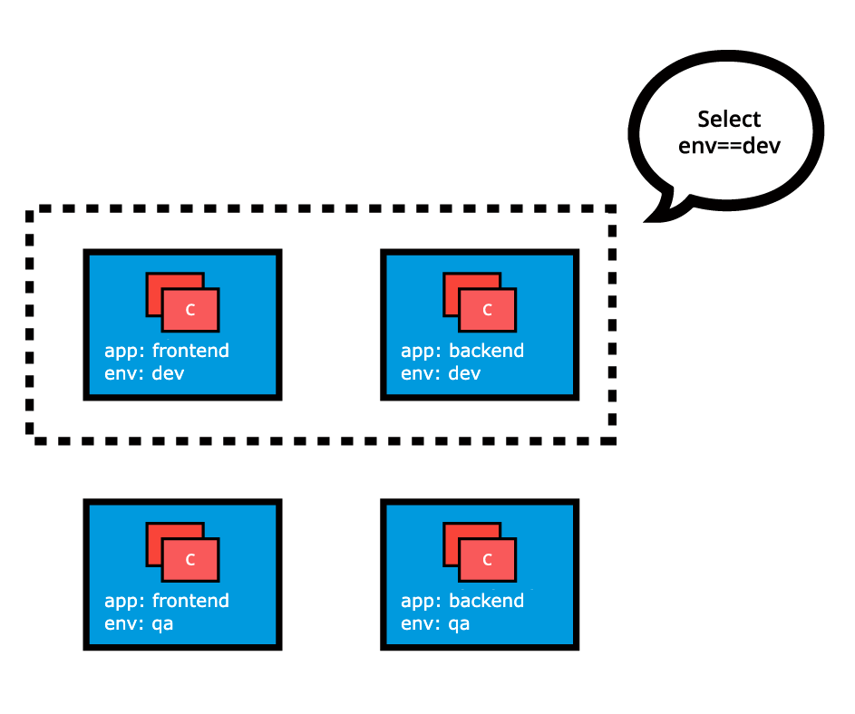

Table of Contents
=================

* [Componentes de Kubernetes](#componentes-de-kubernetes)
   * [Control Plane](#control-plane)
      * [API Server](#api-server)
      * [Scheduler](#scheduler)
      * [Controller Managers](#controller-managers)
      * [Key-Value Data Store](#key-value-data-store)
   * [Worker Node](#worker-node)
      * [Container Runtime](#container-runtime)
      * [Node Agent - Kubelet](#node-agent---kubelet)
         * [Kubelet - CRI shims](#kubelet---cri-shims)
      * [Proxy - kube-proxy](#proxy---kube-proxy)
      * [Add-ons](#add-ons)
   * [Networking challenges](#networking-challenges)
      * [Container-to-Container Communication Inside Pods](#container-to-container-communication-inside-pods)
      * [Pod-to-Pod Communication Across Nodes](#pod-to-pod-communication-across-nodes)
      * [Comunicación del Pod al mundo exterior](#comunicación-del-pod-al-mundo-exterior)
* [Instalando Kubernetes](#instalando-kubernetes)
   * [Clusters locales de desarrollo](#clusters-locales-de-desarrollo)
   * [Clusters de producción](#clusters-de-producción)
   * [Minikube](#minikube)
      * [Manejo avanzado de Minikube](#manejo-avanzado-de-minikube)
* [Accediendo a minikube](#accediendo-a-minikube)
   * [Command Line Interface (CLI) - kubectl](#command-line-interface-cli---kubectl)
   * [Instalando kubectl](#instalando-kubectl)
      * [Configuración de kubectl](#configuración-de-kubectl)
   * [Interface web de usuario (Web UI)](#interface-web-de-usuario-web-ui)
* [APIs](#apis)
   * [APIs con 'kubectl proxy'](#apis-con-kubectl-proxy)
* [APIs con Authentication](#apis-con-authentication)
* [Kubernetes object model](#kubernetes-object-model)
   * [Nodes](#nodes)
   * [Namespaces](#namespaces)
   * [Pods](#pods)
   * [Labels](#labels)
      * [Labels Selectors](#labels-selectors)
   * [Replicaction controller](#replicaction-controller)
   * [ReplicaSets](#replicasets)
   * [Deployments](#deployments)
   * [DaemonSet](#daemonset)
   * [Services](#services)
* [Autenticación, Autorización, control de adminisiones](#autenticación-autorización-control-de-adminisiones)
   * [Autenticación](#autenticación)
   * [Autorización](#autorización)

<!-- Created by https://github.com/ekalinin/github-markdown-toc -->
# Componentes de Kubernetes


## Control Plane

A control plane node runs the following essential control plane
components and agents:

- API Server
- Scheduler
- Controller Managers
- Key-Value Data Store.

In addition, the control plane node runs:

- Container Runtime
- Node Agent
- Proxy
- Optional add-ons for cluster-level monitoring and logging.
- API Server

### API Server

Las tareas administrativas son coordinadas por** kube-apiserver.**

Se encarga de interceptar, validar y procesar las llamadas REST de
usuarios, administradores, desarrolladores, operadores y agentes
externos.

Puede escalar horizontalmente y soporta añadir API Server secundarios
personalizados. En este caso un API Server hace de proxy que envía las
peticiones REST a los secundarios.

### Scheduler

kube-scheduler se encarga de asignar workload objects como los
contenedores encapsulados en pods a los worker nodes.

Esta asignación se hace en base a el estado del cluster de kubernetes y
de los requerimientos de los workload objects. Se siguen estos pasos:

1. Recolección de datos: El scheduler obtiene datos de uso de recursos
    para cada nodo de trabajo en el clúster a través del API Server.
2. Recepción de requisitos: El scheduler recibe los requisitos del
    nuevo objeto de carga de trabajo a través del API Server. Estos
    requisitos pueden incluir restricciones establecidas por los
    usuarios u operadores, como la programación de trabajos en un nodo
    etiquetado con un par clave-valor "disco==ssd".
3. Consideración de factores: El scheduler toma en cuenta diversos
    factores, como los requisitos de calidad de servicio (QoS), la
    localidad de datos, la afinidad, la antiafinidad, las taras, las
    tolerancias, la topología del clúster, etc.
4. Filtrado de nodos: Utilizando un algoritmo de programación, el
    scheduler filtra los nodos con predicados para aislar los posibles
    candidatos.
5. Calificación de nodos: Los nodos candidatos se clasifican en función
    de prioridades para seleccionar el nodo que satisfaga todos los
    requisitos para alojar la nueva carga de trabajo.
6. Decisión de programación: El scheduler comunica el resultado del
    proceso de toma de decisiones al API Server, que luego delega el
    despliegue de la carga de trabajo a otros control-plane agents.

### Controller Managers

Los Controller Managers son componentes de los Control Plane nodes que
ejecutan procesos de control o operador para regular el estado del
clúster de Kubernetes. Los controladores son procesos de bucle de
vigilancia que se ejecutan continuamente y comparan el estado deseado
del clúster (proporcionado por los datos de configuración de los
objetos) con su estado actual (obtenido de la base de datos clave-valor
a través del servidor API). Si hay una discrepancia, se toma una acción
correctiva en el clúster hasta que su estado actual coincida con el
estado deseado.

El **kube-controller-manager**:

- Ejecuta controladores o operadores responsables de actuar cuando los
    nodos se vuelven indisponibles.
- Garantiza que los recuentos de contenedores de pods sean los
    esperados
- Crear puntos finales, cuentas de servicio y tokens de acceso API.

El **cloud-controller-manager**:

- Ejecuta controladores o operadores responsables de interactuar con
    la infraestructura subyacente de un proveedor de nube cuando los
    nodos se vuelven indisponibles.
- Administra volúmenes de almacenamiento cuando se proporcionan como
    servicio en la nube.
- Administra el equilibrio de carga y de enrutamiento.

### Key-Value Data Store

etcd (etcd) es un proyecto de código abierto respaldado por la Cloud
Native Computing Foundation (CNCF). Es una Key-Value Data Store
altamente consistente y distribuida que se utiliza para almacenar el
estado de un clúster de Kubernetes. Los datos nuevos solo se escriben en
la base de datos como apéndices, y los datos nunca se reemplazan. Para
minimizar el tamaño de la base de datos, los datos obsoletos se
compactan periódicamente.

De todos los componentes del control plane, solo el servidor API (API
Server) puede comunicarse con la base de datos de etcd.

La herramienta de administración de CLI de etcd, etcdctl, proporciona
capacidades de guardado y restauración de instantáneas que son útiles,
especialmente para un clúster de Kubernetes de una sola instancia de
etc, común en entornos de desarrollo y aprendizaje.

Sin embargo, en entornos de etapa y producción, es extremadamente
importante replicar las bases de datos en modo HA para garantizar la
resiliencia de los datos de configuración del clúster.

Algunas herramientas de inicio de clústeres de Kubernetes, como kubeadm,
proporcionan de manera predeterminada stacked etcd control plane nodes,
donde la base de datos se ejecuta junto con los otros componentes del
control plane en el mismoccontrol plane node.

## Worker Node

Un **worker node** es una máquina física o virtual que ejecuta
aplicaciones de Kubernetes. Las aplicaciones de Kubernetes son
microservicios que se ejecutan como contenedores. En Kubernetes, los
contenedores de aplicaciones se encapsulan en pods, que son controlados
por los agentes del plano de control del clúster que se ejecutan en el
nodo de control. Los pods se programan en los nodos de trabajo, donde
encuentran los recursos computacionales, de memoria y de almacenamiento
necesarios para ejecutarse, así como la conectividad de red para
comunicarse entre sí y con el mundo exterior.

En un clúster multinodo de Kubernetes, el tráfico de red entre los
usuarios cliente y las aplicaciones contenedorizadas implementadas en
pods se maneja directamente por los nodos de trabajo, y no se enruta a
través del nodo de control.

Un **worker node **tiene los siguientes componentes:

- Container Runtime
- Node Agent - kubelet
- Proxy - kube-proxy
- Add-ons for DNS, Dashboard user interface, cluster-level monitoring
    and logging.

### Container Runtime

A pesar de que Kubernetes se describe como un "motor de orquestación de
contenedores", carece de la capacidad de manejar y ejecutar contenedores
directamente. Para gestionar el ciclo de vida de un contenedor,
Kubernetes requiere un runtime de contenedores en el nodo donde se debe
programar un Pod y sus contenedores. Los runtimes son necesarios en
todos los nodos de un clúster de Kubernetes, tanto en el plano de
control como en los nodos de trabajo. Kubernetes admite varios runtimes
de contenedores:

- **[_CRI-O_](https://cri-o.io/)**: Un runtime de contenedores ligero para
    Kubernetes, que admite los repositorios de imágenes de quay.io y
    Docker Hub.
- **[_Containerd_](https://containerd.io/)**: Un runtime de contenedores
    simple, sólido y portátil.
- **[_Docker Engine_](https://www.docker.com/)**: Una plataforma de
    contenedores popular y compleja que utiliza containerd como runtime
    de contenedores.
-   **[_Mirantis Container
    Runtime_](https://www.mirantis.com/software/container-runtime/)**:
    Anteriormente conocido como Docker Enterprise Edition.

### Node Agent - Kubelet

El kubelet es un agente que se ejecuta en cada nodo, tanto en el plano
de control como en los nodos de trabajo, y se comunica con el plano de
control. Recibe las definiciones de Pods, principalmente del servidor
API, e interactúa con el runtime de contenedores del nodo para ejecutar
los contenedores asociados con el Pod. También supervisa el estado de
salud y los recursos de los Pods que ejecutan contenedores.

El kubelet se conecta a los runtimes de contenedores a través de una
interfaz basada en plugins denominada Interfaz de Runtime de
Contenedores (CRI). El CRI se compone de protocolos, API gRPC,
bibliotecas, especificaciones y herramientas adicionales. Para
conectarse a runtimes de contenedores intercambiables, kubelet utiliza
un shim CRI, una aplicación que proporciona una capa de abstracción
clara entre kubelet y el runtime de contenedores.


Como se muestra arriba, el kubelet, actuando como cliente gRPC, se
conecta al CRI shim, que actúa como servidor gRPC, para realizar
operaciones de contenedores e imágenes. El CRI implementa dos servicios:
ImageService y RuntimeService. ImageService es responsable de todas las
operaciones relacionadas con las imágenes, mientras que RuntimeService
es responsable de todas las operaciones relacionadas con los Pods y los
contenedores.

#### Kubelet - CRI shims

Inicialmente, el agente kubelet solo admitía un par de runtimes de
contenedores: **Docker Engine y rkt**, a través de un modelo de interfaz
único integrado directamente en el código fuente de kubelet. Sin
embargo, este enfoque no estaba destinado a durar para siempre, incluso
si era especialmente beneficioso para Docker.

Con el tiempo, Kubernetes comenzó a migrar hacia un enfoque
estandarizado para la integración de runtimes de contenedores al
introducir CRI. Kubernetes adoptó un método desacoplado y flexible
para integrarse con varios runtimes de contenedores sin necesidad de
compilar nuevamente su código fuente. Cualquier runtime de contenedores
que implemente CRI podría ser utilizado por Kubernetes para
administrar contenedores.

Los **shims** son implementaciones de la interfaz de runtime de contenedores
(CRI), interfaces o adaptadores específicos para cada runtime de
contenedores compatible con Kubernetes. A continuación, presentamos
algunos ejemplos de **shims** CRI:

-   cri-containerd: Este shim permite crear y administrar contenedores
    directamente con containerd a petición de kubelet.


-   CRI-O: Este shim permite utilizar cualquier runtime compatible con
    Open Container Initiative (OCI) con Kubernetes, como runC.


-   dockershim: Antes del lanzamiento de Kubernetes v1.24, este shim
    permitía crear y administrar contenedores al invocar el Docker
    Engine y su runtime interno containerd. Debido a la popularidad del
    Docker Engine, este shim ha sido la interfaz predeterminada
    utilizada por kubelet. Sin embargo, a partir del lanzamiento de
    Kubernetes v1.24, el dockershim ya no es mantenido por el proyecto
    Kubernetes, su código específico se elimina del código fuente de
    kubelet, por lo que ya no será compatible con el agente de nodo
    kubelet de Kubernetes. Como resultado, Docker, Inc. y Mirantis han
    acordado introducir y mantener un adaptador de reemplazo,
    cri-dockerd, que garantiza que el Docker Engine siga siendo una
    opción de runtime de contenedores para Kubernetes, además del
    Mirantis Container Runtime (MCR). La introducción de cri-dockerd
    también garantiza que tanto el Docker Engine como el MCR sigan el
    mismo método de integración estandarizado que los runtimes
    compatibles con CRI.


Para obtener más detalles sobre el proceso de descontinuación del
dockershim, consulte la página Actualizada: [Preguntas frecuentes sobre la eliminación de dockershim.](https://kubernetes.io/blog/2022/02/17/dockershim-faq/)

### Proxy - kube-proxy

**kube-proxy** es el agente de red que se ejecuta en cada nodo, tanto
en el plano de control como en los nodos de trabajo, responsable de las
actualizaciones y el mantenimiento dinámico de todas las reglas de red
en el nodo. Se abstrae de los detalles de la red de los pods y enruta
las solicitudes de conexión a los contenedores en los pods.

**kube-proxy** es responsable del reenvío de flujos TCP, UDP y SCTP o del
reenvío aleatorio a través de un conjunto de backends de Pod de una
aplicación, e implementa las reglas de reenvío definidas por los
usuarios a través de objetos API de Service.

### Add-ons

Los Add-ons son características y funcionalidades de clústeres que aún
no están disponibles en Kubernetes, por lo que se implementan a través
de pods y servicios de terceros.

-   **DNS**: Es un servidor DNS de clúster que se requiere para asignar
    registros DNS a objetos y recursos de Kubernetes.
-   **Dashboard**: Es una interfaz de usuario basada en web de uso
    general para la administración de clústeres.
-   **Monitoring**: Recopila métricas de contenedores a nivel de clúster
    y las guarda en un almacén de datos central.
-   **Logging**: Recopila registros de contenedores a nivel de clúster y
    los guarda en un repositorio de registro central para su análisis.

## Networking challenges

La orquestación de microservicios desacoplados depende en gran medida de
la red para emular la interconexión estrecha que solía existir en la era
monolítica. La red, en general, no es la más fácil de entender e
implementar. Kubernetes no es una excepción: como orquestador de
microservicios en contenedores, debe abordar algunos desafíos de red
distintivos:

-   Comunicación de contenedor a contenedor dentro de Pods.
-   Comunicación de Pod a Pod en el mismo nodo y en diferentes nodos del
    clúster.
-   Comunicación de servicio a Pod dentro del mismo espacio de nombres y
    en diferentes espacios de nombres del clúster.
-   Comunicación de un cliente externo a un servicio para que los
    clientes accedan a las aplicaciones en un clúster.

### Container-to-Container Communication Inside Pods

Utilizando las características de virtualización del kernel del sistema
operativo subyacente, un runtime de contenedores crea un espacio de red
aislado para cada contenedor que inicia. En Linux, este espacio de red
aislado se denomina espacio de nombres de red. Un espacio de nombres de
red se puede compartir entre contenedores o con el sistema operativo
host.

Cuando se inicia un agrupamiento de contenedores definido por un Pod, el
runtime de contenedores inicializa un contenedor de infraestructura
especial llamado Pause contenedor con el único propósito de crear un
espacio de nombres de red para el Pod. Todos los contenedores
adicionales, creados a través de solicitudes de los usuarios, que se
ejecutan dentro del Pod compartirán el espacio de nombres de red del
contenedor de pausa para que todos puedan hablar entre sí a través de
localhost.

### Pod-to-Pod Communication Across Nodes

En un clúster de Kubernetes, los pods, grupos de contenedores, se
programan en nodos de manera casi impredecible. Independientemente de su
nodo host, se espera que los pods puedan comunicarse con todos los demás
pods en el clúster, todo esto sin la implementación de Network Address
Translation (NAT). Este es un requisito fundamental de cualquier
implementación de red en Kubernetes.

El modelo de red de Kubernetes tiene como objetivo reducir la
complejidad, y trata a los pods como máquinas virtuales en una red,
donde cada máquina virtual está equipada con una interfaz de red, por lo
que cada pod recibe una dirección IP única. Este modelo se denomina
"IP-por-pod" y garantiza la comunicación de pod a pod, al igual que las
máquinas virtuales pueden comunicarse entre sí en la misma red.

Sin embargo, no olvidemos los contenedores. Comparten el espacio de
nombres de red del pod y deben coordinar la asignación de puertos dentro
del pod como lo harían las aplicaciones en una máquina virtual, al
tiempo que pueden comunicarse entre sí a través de localhost, dentro del
pod. Sin embargo, los contenedores se integran con el modelo de red
general de Kubernetes a través del uso de la [_Container Network
Interface_](https://github.com/containernetworking/cni) (CNI) compatible
con los [_CNI
plugins_](https://github.com/containernetworking/cni#3rd-party-plugins).
CNI es un conjunto de especificaciones y bibliotecas que permiten a los
plugins configurar la red para los contenedores. Si bien hay algunos
[_core
plugins_](https://github.com/containernetworking/plugins#plugins), la
mayoría de los plugins de CNI son soluciones de red definidas por
software (SDN) de terceros que implementan el modelo de red de
Kubernetes. Además de abordar el requisito fundamental del modelo de
red, algunas soluciones de red ofrecen soporte para políticas de red.
[_Flannel_](https://github.com/coreos/flannel/),
[_Weave_](https://www.weave.works/oss/net/),
[_Calico_](https://www.tigera.io/project-calico/) son solo algunas de
las soluciones SDN disponibles para clústeres de Kubernetes.


El runtime de contenedor delega la asignación de IP a CNI, que se
conecta al complemento configurado subyacente, como Bridge o MACvlan,
para obtener la dirección IP. Una vez que la dirección IP es dada por el
complemento respectivo, CNI la reenvía de vuelta al runtime de
contenedor solicitado.

Para obtener más detalles, puede explorar la [_documentación de
Kubernetes_](https://kubernetes.io/docs/concepts/cluster-administration/networking/).

### Comunicación del Pod al mundo exterior

Todas las aplicaciones desplegadas con éxito dentro de un Pod en un
clúster dentro de Kubernetes, necesitan que sean accesibles desde el
exterior. Para ello Kubernete lo hace accesible habilitando una serie de
servicios en los que se encapsula una serie de reglas de red iptables en
los clúster del nodo. Los servicios se exponen al exterior gracias a
Kube-proxy.

# Instalando Kubernetes

Kubernetes se puede instalar utilizando diferentes configuraciones de
clúster. Los principales tipos de instalación se describen a
continuación:

**Single Node:**

En esta configuración, todos los componentes del plano de control y los
nodos de trabajo se instalan y ejecutan en un solo nodo. Aunque es útil
para aprender, desarrollar y probar, no se recomienda para fines de
producción.

**Instalación de un Single Control-Plane y varios Worker Node:**

En esta configuración, tenemos un solo nodo de plano de control que
ejecuta una instancia de etcd apilada. Varios nodos de trabajo pueden
ser gestionados por el nodo de plano de control.

**Instalación de un Single Control-Plane con un Single Node-etcd y
varios Worker Node:**

En esta configuración, tenemos un único nodo de plano de control con una
instancia de etcd externa. Varios nodos de trabajo pueden ser
gestionados por el nodo de plano de control.

**Instalación de múltiples Control-Plane y varios Worker Node:**

En esta configuración, tenemos varios nodos de plano de control
configurados para alta disponibilidad (HA), cada nodo de plano de
control ejecutando una instancia apilada de etcd. Las instancias de etcd
también están configuradas en un clúster HA de etcd y varios nodos de
trabajo pueden ser gestionados por el plano de control de HA.

**Instalación de varios Control-Planel con varios nodos etcd y varios
Worker Node:**

En esta configuración, tenemos varios nodos de plano de control
configurados en modo HA, cada nodo de plano de control emparejado con
una instancia de etcd externa. Las instancias de etcd externas también
están configuradas en un clúster HA de etcd, y varios nodos de trabajo
pueden ser gestionados por el plano de control de HA. Esta es la
configuración de clúster más avanzada recomendada para entornos de
producción.

A medida que aumenta la complejidad del clúster de Kubernetes, también
lo hacen sus requisitos de hardware y recursos. Aunque podemos
implementar Kubernetes en un solo host para fines de aprendizaje,
desarrollo y posiblemente pruebas, la comunidad recomienda entornos
multi-host que admitan configuraciones de plano de control de alta
disponibilidad y varios nodos de trabajo para la carga de trabajo de los
clientes para fines de producción.

## Clusters locales de desarrollo

Existen diversas herramientas de instalación que nos permiten
implementar clústeres de Kubernetes de uno o varios nodos en nuestras
estaciones de trabajo, con fines de aprendizaje y desarrollo. Si bien no
es una lista exhaustiva, enumeramos algunas de las más populares a
continuación:

-   **Minikube**: Clúster local de Kubernetes de uno o varios nodos,
    recomendado para entornos de aprendizaje desplegados en una sola
    máquina.
-   **Kind**: Clúster multinodo de Kubernetes desplegado en contenedores
    de Docker que actúan como nodos de Kubernetes. Se recomienda para
    entornos de aprendizaje.
-   **Docker Desktop**: Incluye un clúster de Kubernetes local para
    usuarios de Docker.
-   **MicroK8s**: Clúster local y en la nube de Kubernetes para
    desarrolladores y producción, de Canonical.
-   **K3S**: Clúster ligero de Kubernetes para implementaciones locales,
    en la nube, en los bordes y en IoT. Originalmente de Rancher,
    actualmente un proyecto de CNCF.

## Clusters de producción

Existen varias herramientas recomendadas para inicializar clústeres de
Kubernetes y algunas que también son capaces de proporcionar los hosts
necesarios en la infraestructura subyacente.

Echemos un vistazo a las herramientas de instalación más populares
disponibles:

-   **kubeadm**: kubeadm es un ciudadano de primera clase del ecosistema
    de Kubernetes. Es un método seguro y recomendado para iniciar un
    clúster multinodo listo para producción de alta disponibilidad (HA)
    de Kubernetes, ya sea localmente o en la nube. kubeadm también puede
    iniciar un clúster de un solo nodo para fines de aprendizaje. Tiene
    un conjunto de bloques de construcción para configurar el clúster,
    pero es fácilmente ampliable para agregar más funciones. Tenga en
    cuenta que kubeadm no admite el aprovisionamiento de hosts; deben
    provisionarse por separado con una herramienta de nuestra elección.
-   **kubespray**: kubespray (anteriormente conocido como kargo) nos
    permite instalar clústeres de producción listos para Kubernetes de
    alta disponibilidad en AWS, GCP, Azure, OpenStack, vSphere o
    hardware sin servidor. kubespray se basa en Ansible y está
    disponible en la mayoría de las distribuciones de Linux. Es un
    proyecto Kubernetes Incubator.
-   **kops**: kops nos permite crear, actualizar y mantener clústeres de
    alta disponibilidad de grado de producción de Kubernetes desde la
    línea de comandos. También puede provisionar la infraestructura
    requerida. Actualmente, AWS y GCE son oficialmente compatibles.

  ----------------- ----------------------------- -------------------------- ----------------------
  **Herramienta**   **Aprovisionamiento hosts**   **Baremetal compatible**   **Cloud compatible**
  kubeadm           No                            Sí                         Sí
  kubespray         Ansible                       Sí                         Sí
  kops              Terraform                     No                         Sí
  ----------------- ----------------------------- -------------------------- ----------------------

## Minikube

[_Minikube_](https://minikube.sigs.k8s.io/) es uno de los métodos más
fáciles, flexibles y populares para ejecutar un clúster de Kubernetes
local de uno o varios nodos, usando máquinas virtuales (VM) o
contenedores, que se ejecuta directamente en nuestras estaciones de
trabajo.

Este aislamiento de los componentes del clúster de nuestro entorno
diario garantiza que una vez que ya no sean necesarios, los componentes
de Minikube se puedan eliminar de forma segura sin dejar rastro de
cambios de configuración en nuestra estación de trabajo, por lo que no
quedarán rastros de su existencia

Minikube es la herramienta responsable de la instalación de los
componentes de Kubernetes, el inicio del clúster y el desmontaje del
clúster cuando ya no es necesario.

Incluye características adicionales destinadas a facilitar la
interacción del usuario con el clúster de Kubernetes, pero, sin embargo,
nos inicializa un clúster de Kubernetes completamente funcional y no de
producción, extremadamente conveniente para fines de aprendizaje.

Minikube admite la inicializacion de clusters single-node o multinode.

Después de la fase de provisión de nodos, Minikube invoca kubeadm para
iniciar los componentes del clúster de Kubernetes dentro de los nodos
provistos anteriormente. Necesitamos asegurarnos de que tengamos el
hardware y el software necesarios que requiere Minikube para construir
nuestro entorno.

Requisitos de Minikube

Para ejecutar Minikube en nuestra estación de trabajo local, necesitamos
cumplir con los siguientes requisitos:

-   Habilitar la virtualización **VT-x/AMD-v** en la estación de trabajo
    local.

-   Instalar kubectl. kubectl es una herramienta binaria que se utiliza
    para acceder y administrar cualquier clúster de Kubernetes. Se
    instala a través de Minikube y se accede a ella mediante el comando
    minikube kubectl o se puede instalar por separado y ejecutar como
    una herramienta independiente. Exploraremos la instalación y el uso
    de kubectl en capítulos futuros.

-   Instalar un hipervisor de tipo 2 o un runtime de contenedores. Sin
    especificar un controlador, Minikube intentará encontrar un
    hipervisor o un runtime instalado.

-   -   Linux: VirtualBox, KVM2, QEMU, Docker y Podman.

    -   Windows: VirtualBox, Hyper-V, VMware Workstation y QEMU.

    -   macOS: VirtualBox, HyperKit, VMware Fusion, Parallels y QEMU.

Si se encuentran varias instalaciones de software de aislamiento, como
docker y virtualbox, Minikube elegirá docker en lugar de virtualbox si
el usuario no especifica un controlador deseado.

-   Conexión a Internet en la primera ejecución de Minikube. Se necesita
    una conexión a Internet para descargar paquetes, dependencias,
    actualizaciones y extraer imágenes necesarias para inicializar los
    componentes del clúster de Kubernetes de Minikube. Las ejecuciones
    posteriores de Minikube solo requerirán una conexión a Internet
    cuando se necesiten extraer nuevas imágenes de contenedor desde un
    registro de contenedor público o cuando las aplicaciones
    contenedorizadas desplegadas la necesiten para la accesibilidad del
    cliente. Una vez que se ha extraído una imagen de contenedor, se
    puede reutilizar desde el caché de imágenes de runtime de contenedor
    local sin una conexión a Internet.

### Manejo avanzado de Minikube

```shell
minikube start --kubernetes-version=v1.23.3 \
  --driver=podman --profile minipod

minikube start --nodes=2 --kubernetes-version=v1.24.4 \
  --driver=docker --profile doubledocker

minikube start --driver=virtualbox --nodes=3 --disk-size=10g \
  --cpus=2 --memory=4g --kubernetes-version=v1.25.1 --cni=calico \
  --container-runtime=cri-o -p multivbox

minikube start --driver=docker --cpus=6 --memory=8g \
  --kubernetes-version="1.24.4" -p largedock

minikube start --driver=virtualbox -n 3 --container-runtime=containerd \
  --cni=calico -p minibox
```
Se puede crear mas de un cluster simultaneamente usando --profile. Una vez creados se pueden listar con:
```shell
minikube profile list  
|----------|------------|---------|----------------|------|---------|---------|-------|--------|
| Profile  | VM Driver  | Runtime |       IP       | Port | Version | Status  | Nodes | Active |
|----------|------------|---------|----------------|------|---------|---------|-------|--------|
| minibox  | virtualbox | crio    | 192.168.59.101 | 8443 | v1.25.3 | Running |     3 |        |
| minikube | virtualbox | docker  | 192.168.59.100 | 8443 | v1.25.3 | Running |     1 | *      |
|----------|------------|---------|----------------|------|---------|---------|-------|--------|
```
El marcador "Active" indica el perfil de target cluster que usa el comando minikube cuando no se indica nada mas.  
Este perfil se puede cambiar:

```shell
minikube profile minibox
```

También se puede volver al perfil de target cluster predefinido con uno de estos comandos:
```shell
minikube profile minikube

minikube profile default  
```

La mayoría de los comandos de minikube, como start, stop, node, etc., están basados en perfiles, lo que significa que el usuario debe especificar el clúster objetivo del comando mediante su nombre de perfil. Sin embargo, el clúster de minikube predeterminado se puede administrar sin especificar su nombre de perfil. 

```shell
minikube stop -p minibox

minikube start -p minibox

minikube stop

minikube start
```

Comandos minikube adicionales útiles:

Para saber la versión de minikube:

```shell
minikube version

minikube version: v1.28.0
commit: 986b1ebd987211ed16f8cc10aed7d2c42fc8392f
```

El autocompletado es una configuración útil posterior a la instalación que permite que el comando minikube responda a los mecanismos típicos de autocompletado, como completar un comando en el terminal presionando la tecla TAB. Para habilitar el autocompletado para el shell bash en Ubuntu:

```shell
sudo apt install bash-completion

source /etc/bash_completion

source <(minikube completion bash)
```

Si es necesario, también ejecute el siguiente comando:
```shell
minikube completion bash
```

Este comando permite a los usuarios enumerar los nodos de un clúster, agregar nuevos nodos de control o trabajadores, eliminar nodos de clúster existentes, iniciar o detener nodos individuales de un clúster:

```shell
minikube node list

minikube 192.168.59.100

minikube node list -p minibox

minibox   192.168.59.101
minibox-m02   192.168.59.102
minibox-m03   192.168.59.103
```

Para mostrar la dirección IP del nodo del plano de control del clúster u otra dirección IP del nodo con las banderas --node o -n:

```shell
minikube ip

192.168.59.100

minikube -p minibox ip

192.168.59.101

minikube -p minibox ip -n minibox-m02

192.168.59.102
```

Cuando una configuración de clúster ya no se utiliza, se puede eliminar el perfil del clúster. También es un comando basado en perfiles: elimina el clúster minikube predeterminado si no se especifica ningún perfil, o un clúster personalizado si se especifica su perfil.

```shell
minikube delete

  Deleting "minikube" in virtualbox ...
  Removed all traces of the "minikube" cluster.

minikube delete -p minibox

  Deleting "minibox" in virtualbox ...
  Deleting "minibox-m02" in virtualbox ...
  Deleting "minibox-m03" in virtualbox ...
  Removed all traces of the "minibox" cluster.
```

Para opciones adicionales se puede visitar [*Minikube command line reference.*](https://minikube.sigs.k8s.io/docs/commands/)  

# Accediendo a minikube

## Command Line Interface (CLI) - kubectl

[_kubectl_](https://kubernetes.io/docs/reference/kubectl/overview/) es la interfaz de línea de comandos (CLI) de Kubernetes para administrar recursos y aplicaciones del clúster. Es muy flexible y se integra fácilmente con otros sistemas, por lo que se puede usar de forma independiente o como parte de scripts y herramientas de automatización. Una vez que se hayan configurado todas las credenciales y puntos de acceso del clúster necesarios para kubectl, se puede usar de forma remota desde cualquier lugar para acceder a un clúster.

**kubectl**, la interfaz de línea de comandos de Kubernetes, permite administrar clústeres locales de Kubernetes como el clúster Minikube o clústeres remotos implementados en la nube. Generalmente se instala antes de instalar e iniciar Minikube, pero también se puede instalar después del paso de arranque del clúster.

Una instalación de Minikube tiene su propia interfaz de línea de comandos kubectl instalada y lista para usar. Sin embargo, su uso puede ser poco práctico ya que el comando **kubectl** se convierte en un subcomando del comando **minikube**. Los usuarios tendrían que escribir comandos más largos, como:
`minikube kubectl -- <subcomando> <tipo-objeto> <nombre-objeto> -o --opción`
, en lugar de simplemente `kubectl <subcomando> <tipo-objeto> <nombre-objeto> -o --opción.` Si bien una solución simple sería establecer un alias, se recomienda ejecutar la herramienta CLI de kubectl como una instalación independiente.

Una vez instalado por separado, **kubectl** recibe automáticamente su configuración para acceder al clúster Kubernetes de Minikube. Sin embargo, en diferentes configuraciones de clústeres de Kubernetes, es posible que necesitemos configurar manualmente los puntos de acceso del clúster y los certificados requeridos por **kubectl** para acceder de forma segura al clúster.

Existen diferentes métodos para instalar **kubectl**, enumerados en [_la documentación de Kubernetes_](https://kubernetes.io/docs/tasks/tools/#kubectl). Para obtener los mejores resultados, se recomienda mantener kubectl dentro de una versión menor de la versión de Kubernetes deseada. A continuación, describiremos el proceso de instalación de la CLI de **kubectl**.

Puede encontrar detalles adicionales sobre el cliente de línea de comandos **kubectl** en el [_libro de kubectl_](https://kubectl.docs.kubernetes.io/), [_la documentación oficial de Kubernetes_](https://kubernetes.io/docs/reference/kubectl/) o su [_repositorio de GitHub_](https://github.com/kubernetes/kubectl).
## Instalando kubectl
Cómo [_instalar_](https://kubernetes.io/docs/tasks/tools/install-kubectl-linux/) kubectl en Linux:

Descarga e instala el binario kubectl estable más reciente:

 ```shell
curl -LO "[https://dl.k8s.io/release/(curl](https://dl.k8s.io/release/(curl) -L -s https://dl.k8s.io/release/stable.txt)/bin/linux/amd64/kubectl/bin/linux/amd64/kubectl)"

sudo install -o root -g root -m 0755 kubectl /usr/local/bin/kubectl
```
   
La primera línea descarga el binario kubectl de la última versión estable.

La segunda línea lo instala en /usr/local/bin/kubectl con permisos de root.

*Descarga e instala una versión específica de kubectl (opcional):*

```shell
curl -LO https://dl.k8s.io/release/v1.25.1/bin/linux/amd64/kubectl
```

Reemplaza v1.25.1 con la versión deseada.

Verifica la versión instalada:

```shell
kubectl version --client
```

Habilita el autocompletado para kubectl (opcional):

```shell
sudo apt install -y bash-completion
source /usr/share/bash-completion/bash_completion
source <(kubectl completion bash)
echo 'source <(kubectl completion bash)' >>~/.bashrc
```

Estos comandos habilitan el autocompletado para kubectl en el shell bash.

Para instalar kubectl en [_MacOS_](https://kubernetes.io/docs/tasks/tools/install-kubectl-macos/)
Para instalar kubectl en [_Windows_](https://kubernetes.io/docs/tasks/tools/install-kubectl-windows/)

### Configuración de kubectl

Para acceder al clúster de Kubernetes, el cliente **kubectl** necesita el punto final del nodo del plano de control y las credenciales apropiadas para poder interactuar de forma segura con el servidor API que se ejecuta en el nodo del plano de control. Al iniciar Minikube, el proceso de inicio crea de forma predeterminada un archivo de configuración, config, dentro del directorio `~/.kube` (a menudo denominado kubeconfig), que reside en el directorio de inicio del usuario. 
El archivo de configuración tiene todos los detalles de conexión requeridos por kubectl. De manera predeterminada, el binario kubectl analiza este archivo para encontrar el punto final de conexión del nodo del plano de control, junto con las credenciales requeridas. Se pueden configurar varios archivos kubeconfig con un solo cliente kubectl.

Para ver los detalles de la conexión, podemos mostrar el contenido del archivo ~/.kube/config (en Linux) o ejecutar el siguiente comando (la salida está redactada para mayor legibilidad):
```shell
kubectl config view
```
```yaml
apiVersion: v1
clusters:
- cluster:
    certificate-authority: /home/student/.minikube/ca.crt
    server: https://192.168.99.100:8443
  name: minikube
contexts:
- context:
    cluster: minikube
    user: minikube
  name: minikube
current-context: minikube
kind: Config
preferences: {}
users:
- name: minikube
  user:
    client-certificate: /home/student/.minikube/profiles/minikube/client.crt
    client-key: /home/student/.minikube/profiles/minikube/client.key
```
El kubeconfig incluye el punto final del servidor API server: **https://192.168.99.100:8443** y los datos de **clave** y **certificado** de autenticación del usuario minikube.

Una vez que **kubectl** está instalado, podemos mostrar información sobre el clúster de Kubernetes de Minikube con el comando kubectl cluster-info:

```shell
kubectl cluster-info
Kubernetes master is running at https://192.168.99.100:8443
KubeDNS is running at https://192.168.99.100:8443/api/v1/namespaces/kube-system/services/kube-dns:dns/proxy
```

Para depurar y diagnosticar más problemas del clúster, use `'`kubectl cluster-info dump`.

Puede encontrar más detalles sobre las opciones de la línea de comandos de kubectl [_aquí_](https://kubernetes.io/docs/reference/kubectl/overview/).

Aunque para el clúster de Kubernetes instalado por Minikube se crea automáticamente el archivo ~/.kube/config, no es el caso de los clústeres de Kubernetes instalados por otras herramientas. En otros casos, el archivo de configuración debe crearse manualmente y, a veces, reconfigurarse para adaptarse a varias configuraciones de red y cliente/servidor.

## Interface web de usuario (Web UI)


# APIs

El componente principal del plano de control de Kubernetes es el Servidor API, responsable de exponer las API de Kubernetes. Las API permiten a los operadores y usuarios interactuar directamente con el clúster. Usando tanto las herramientas CLI como la interfaz de usuario del panel de control, podemos acceder al servidor API que se ejecuta en el nodo del plano de control para realizar diversas operaciones para modificar el estado del clúster. El servidor API es accesible a través de sus puntos finales por agentes y usuarios que poseen las credenciales requeridas.  

  

El árbol de directorios de la API HTTP de Kubernetes se puede dividir en tres grupos independientes:

* Core group (**/api/v1)**:Este grupo incluye objetos como Pods, Servicios, Nodos, Espacios de nombres, ConfigMaps, Secretos, etc.

* Named group: Este grupo incluye objetos en formato /apis/$NOMBRE/$VERSION. Estas diferentes versiones de API implican distintos niveles de estabilidad y soporte:
	1. *Nivel Alfa:* puede eliminarse en cualquier momento sin previo aviso. Por ejemplo, /apis/batch/v2alpha1.
	2. *Nivel Beta:* está bien probado, pero la semántica de los objetos puede cambiar de manera incompatible en una versión beta o estable posterior. Por ejemplo, /apis/certificates.k8s.io/v1beta1.
	3. *Nivel Estable:* aparece en el software lanzado para muchas versiones posteriores. Por ejemplo, /apis/networking.k8s.io/v1.

* Sistema completo: Este grupo consta de puntos de acceso de API para todo el sistema, como /healthz, /logs, /metrics, /ui, etc.

Podemos acceder a un servidor API directamente llamando a los puntos de acceso de API respectivos, utilizando las herramientas CLI o la interfaz de usuario del panel de control.

## APIs con 'kubectl proxy'

Al lanzar el comando `kubectl proxy` , kubectl se autentica con el servidor API en el control plain node y hace que los servicios estén disponibles en el puerto proxy predeterminado 8001.

Lanzamos el comando:

```shell
kubectl proxy

Starting to serve on 127.0.0.1:8001
```

Bloquea el terminal mientras se ejecuta el proxy, a menos que lo ejecutemos en segundo plano (con kubectl proxy &).

Cuando kubectl proxy se está ejecutando, podemos enviar solicitudes a la API a través de localhost en el puerto proxy predeterminado 8001 (desde otro terminal, ya que el proxy bloquea el primer terminal cuando se ejecuta en primer plano):

```shell
curl http://localhost:8001/

{
 "paths": [
   "/api",
   "/api/v1",
   "/apis",
   "/apis/apps",
   ......
   ......
   "/logs",
   "/metrics",
   "/openapi/v2",
   "/version"
 ]
}
```

Con la solicitud curl anterior, solicitamos todos los puntos finales de la API del servidor API. Al hacer clic en el enlace anterior (en el comando curl), se abrirá la misma salida de listado en una pestaña del navegador.

Podemos explorar varias combinaciones de rutas con curl o en un navegador también, como:

```shell

http://localhost:8001/api/v1

http://localhost:8001/apis/apps/v1

http://localhost:8001/healthz

http://localhost:8001/metrics
```

# APIs con Authentication
Cuando no se usa kubectl proxy, necesitamos autenticarnos en el Servidor API al enviar solicitudes de API. Podemos autenticarnos proporcionando un Token Bearer al emitir un comando curl o proporcionando un conjunto de claves y certificados.

Un Token Bearer es un token de acceso que puede ser generado por el servidor de autenticación (el Servidor API en el nodo del plano de control) a petición del cliente. Utilizando ese token, el cliente puede comunicarse de forma segura con el Servidor API de Kubernetes sin proporcionar detalles de autenticación adicionales y luego acceder a los recursos. Puede ser necesario volver a proporcionar el token para las solicitudes de acceso a recursos posteriores.

Creamos un token de acceso para la Cuenta de Servicio predeterminada y otorgamos un permiso especial para acceder al directorio raíz de la API (un permiso especial que no era necesario cuando se usaba kubectl proxy anteriormente). El permiso especial se establecerá mediante una política de Control de Acceso Basado en Roles (RBAC). La política es el clusterrole definido a continuación, que se otorga a través de la definición clusterrolebinding (RBAC, clusterroles y clusterrolebindings se discutirán en un capítulo posterior). El permiso especial solo es necesario para acceder al directorio raíz de la API, pero no para acceder a /api, /apis u otros subdirectorios:
```shell
export TOKEN=$(kubectl create token default)
kubectl create clusterrole api-access-root \
 --verb=get --non-resource-url=/*
kubectl create clusterrolebinding api-access-root \
 --clusterrole api-access-root --serviceaccount=default:default
```

Recuperamos el punto final del Servidor API:

```shell
export APISERVER=$(kubectl config view | grep https | \
 cut -f 2- -d ":" | tr -d " ")
```

Comprobamos que el APISERVER almacena la misma IP que la IP del plano de control de Kubernetes emitiendo los siguientes dos comandos y comparando sus salidas:

```shell
echo $APISERVER
https://192.168.99.100:8443
kubectl cluster-info
Kubernetes control plane is running at https://192.168.99.100:8443 ...
```

Accedemos al Servidor API usando el comando curl, como se muestra a continuación:
```shell
curl $APISERVER --header "Authorization: Bearer $TOKEN" --insecure
{
 "paths": [
  "/api",
  "/api/v1",
  "/apis",
  "/apis/apps",
  ......
  ......
  "/logs",
  "/metrics",
  "/openapi/v2",
  "/version"
 ]
}
```

Podemos ejecutar comandos curl adicionales para recuperar detalles sobre grupos de API específicos de la siguiente manera. Estos comandos deberían funcionar incluso sin el permiso especial definido anteriormente y otorgado a la Cuenta de Servicio predeterminada asociada con el token de acceso:

```shell
curl $APISERVER/api/v1 --header "Authorization: Bearer $TOKEN" --insecure
curl $APISERVER/apis/apps/v1 --header "Authorization: Bearer $TOKEN" --insecure
curl $APISERVER/healthz --header "Authorization: Bearer $TOKEN" --insecure
curl $APISERVER/metrics --header "Authorization: Bearer $TOKEN" --insecure
```

En lugar del token de acceso, podemos extraer el certificado de cliente, la clave de cliente y los datos de la autoridad de certificación del archivo .kube/config. Una vez extraídos, se pueden codificar y luego pasar con un comando curl para la autenticación. El nuevo comando curl sería similar al ejemplo siguiente. Sin embargo, tenga en cuenta que el comando de ejemplo siguiente solo funcionaría con los datos de certificado de cliente, clave y autoridad de certificación codificados en base 64, y se proporciona solo con fines ilustrativos.

```shell
curl $APISERVER --cert encoded-cert --key encoded-key --cacert encoded-ca
```
# Kubernetes object model 
Kubernetes se popularizó por sus capacidades avanzadas de gestión del ciclo de vida de aplicaciones, implementadas a través de un modelo de objetos rico, que representa diferentes entidades persistentes en el clúster de Kubernetes. Estas entidades describen:

* Qué aplicaciones contenedorizadas estamos ejecutando.
* Los nodos donde se despliegan las aplicaciones contenedorizadas.
* El consumo de recursos de la aplicación.
* Políticas adjuntas a las aplicaciones, como políticas de reinicio/actualización, tolerancia a fallos, ingreso/salida, control de acceso, etc.

Con cada objeto, declaramos nuestra intención, o el estado deseado del objeto, en la sección spec. El sistema Kubernetes gestiona la sección status de los objetos, donde registra el estado real del objeto. En cualquier momento, el **control plane** de Kubernetes intenta hacer coincidir el estado real del objeto con el estado deseado del objeto.

Una definición de manifiesto de objeto debe incluir otros campos que especifiquen la versión de la API a la que estamos haciendo referencia como apiVersion, el tipo de objeto como kind y datos adicionales útiles para el clúster o los usuarios con fines contables - el metadata. Ejemplos de tipos de objetos de Kubernetes son **Nodes, Namespaces, Pods, ReplicaSets, Deployments, DaemonSets, etc**. Los exploraremos más adelante.

Al crear un objeto, la sección de datos de configuración del objeto debajo del campo spec debe enviarse al Servidor API de Kubernetes. La solicitud de API para crear un objeto debe tener la sección spec, que describe el estado deseado, así como otros detalles. Aunque el servidor API acepta definiciones de objetos en formato JSON, la mayoría de las veces proporcionamos manifiestos de definición en formato YAML que kubectl convierte en una carga útil JSON y envía al servidor API.

## Nodes

Los [_Nodes_](https://kubernetes.io/docs/concepts/architecture/nodes/) son identidades virtuales asignadas por Kubernetes a los sistemas que forman parte del clúster, ya sean máquinas virtuales, servidores bare-metal, contenedores, etc. Estas identidades son únicas para cada sistema y las usa el clúster para contabilizar y monitorear recursos, lo que ayuda a administrar la carga de trabajo en todo el clúster.

Cada **Node** se gestiona con la ayuda de dos agentes de nodo de Kubernetes: kubelet y kube-proxy, aunque también alberga un tiempo de ejecución de contenedores. El tiempo de ejecución de contenedores es necesario para ejecutar toda la carga de trabajo en contenedores en el **Node**, desde los agentes del plano de control hasta las cargas de trabajo de los usuarios. Los agentes de nodo kubelet y kube-proxy son responsables de ejecutar todas las tareas locales relacionadas con la gestión de la carga de trabajo: 
- Interactuar con el tiempo de ejecución para ejecutar contenedores
- Monitorear la salud de los contenedores y del Node.
- Informar de cualquier problema y del estado del Node al Servidor API y gestionar el tráfico de red hacia los contenedores.

Basándose en sus funciones predeterminadas, existen dos tipos de Nodes distintos: **control plane** y **worker**. Un clúster de Kubernetes típico incluye al menos un **control plane** **Node** , pero puede incluir múltiples **Nodes** de **control plane** para un **control plane de alta disponibilidad** (HA). 

Además, el clúster incluye uno o más **Nodes** **worker** para proporcionar redundancia de recursos en el clúster. Hay casos en los que un solo clúster todo en uno se arranca como un solo **Node** en una sola máquina virtual, servidor bare-metal o contenedor, cuando la alta disponibilidad y la redundancia de recursos no son importantes. 

Estos son **Nodes** híbridos o mixtos que alojan tanto agentes del plano de control como cargas de trabajo de usuario en el mismo sistema. 

Minikube nos permite arrancar clústeres de múltiples Nodes con distintos **Nodes** de plano de **control plane**; sin embargo, si nuestro sistema host tiene una cantidad limitada de recursos físicos, podemos arrancar fácilmente un único clúster todo en uno como un solo **worker** en una sola máquina virtual o contenedor, y aun así poder explorar la mayoría de los temas cubiertos en este curso, con la excepción de las características específicas de los clústeres de múltiples Nodes, como *DaemonSets, redes de múltiples Nodes, etc.*

Las identidades de **Node** se crean y asignan durante el proceso de arranque del clúster por la herramienta responsable de inicializar los agentes del clúster. Minikube utiliza la herramienta de arranque predeterminada kubeadm para inicializar el Node del plano de control durante la fase de inicio y hacer crecer el clúster añadiendo Nodes trabajadores o de plano de control con la fase de unión.

Los **Nodes** del plano de control ejecutan los **Control Plane Agents**, como el Servidor API, el Programador, los Administradores de Controladores y etcd, además de los agentes de **Node** kubelet y kube-proxy, el tiempo de ejecución de contenedores y complementos para redes de contenedores, monitoreo, registro, DNS, etc.

Los **Nodes** **workers** ejecutan los agentes de Node kubelet y kube-proxy, el tiempo de ejecución de contenedores y complementos para redes de contenedores, monitoreo, registro, DNS, etc.

## Namespaces

Si múltiples usuarios y equipos usan el mismo clúster de Kubernetes, podemos dividir el clúster en subclústeres virtuales usando [_Namespaces_](https://kubernetes.io/docs/concepts/overview/working-with-objects/namespaces/). Los nombres de los recursos/objetos creados dentro de un **Namespace** son únicos, pero no en todos los Namespaces del clúster.

Para listar todos los **Namespaces**, podemos ejecutar el siguiente comando:

```shell
kubectl get namespaces

NAME              STATUS       AGE
default           Active       11h
kube-node-lease   Active       11h
kube-public       Active       11h
kube-system       Active       11h
```

Generalmente, Kubernetes crea cuatro **Namespaces** listos para usar:
* kube-system
* kube-public
* kube-node-lease
* default
*
El Namespace **kube-system** contiene los objetos creados por el sistema Kubernetes, principalmente los **Control Plane Agents**. 
El **Namespace** **default** contiene los objetos y recursos creados por administradores y desarrolladores, y los objetos se le asignan por defecto a menos que el usuario proporcione otro nombre de Namespace. 
**kube-public** es un Namespace especial, no seguro y legible por cualquiera, utilizado para fines especiales como exponer información pública (no sensible) sobre el clúster. 
El Namespace más nuevo es **kube-node-lease**, que contiene objetos de arrendamiento de nodos utilizados para los datos de latido del nodo.

Sin embargo, una buena práctica es crear **Namespaces** adicionales, según sea necesario, para virtualizar el clúster y aislar usuarios, equipos de desarrolladores, aplicaciones o niveles:
```shell
kubectl create namespace nuevo-nombre-de-namespace
```

Los Namespaces son una de las características más deseadas de Kubernetes, que le asegura una ventaja sobre sus competidores, ya que proporciona una solución al requisito de multitenencia de los equipos de desarrollo empresarial actuales.

Las [_cuotas de recursos_](https://kubernetes.io/docs/concepts/policy/resource-quotas/) ayudan a los usuarios a limitar el consumo general de recursos dentro de los Namespaces, mientras que los [_LimitRanges_](https://kubernetes.io/docs/concepts/policy/limit-range/) ayudan a limitar los recursos consumidos por los Pods y sus objetos circundantes en un Namespace. Cubriremos brevemente la gestión de cuotas en un capítulo posterior.

## Pods

Un Pod es el objeto de carga de trabajo más pequeño de Kubernetes. Es la unidad de implementación en Kubernetes, que representa una instancia de la aplicación. Un Pod es una colección lógica de uno o más contenedores, que los encapsula y aísla para asegurar que:

* Se programen juntos en el mismo host con el Pod.
* Compartan el mismo espacio de nombres de red, lo que significa que comparten una única dirección IP asignada originalmente al Pod.
* Tengan acceso para montar el mismo almacenamiento externo (volúmenes) y otras dependencias comunes.


Tipos de Pods:

* Pods con un solo contenedor: La mayoría de los Pods ejecutan un solo contenedor.
* Pods con múltiples contenedores: Algunos Pods ejecutan dos o más contenedores que trabajan juntos para proporcionar una funcionalidad más compleja.

Pods y controladores:

Los Pods son efímeros por naturaleza y no tienen la capacidad de autorepararse. Por eso se utilizan con controladores (u operadores), que se encargan de la replicación de Pods, la tolerancia a fallos, la autocuración, etc. Ejemplos de controladores son **Deployments, ReplicaSets, DaemonSets, Jobs, etc**. Cuando se utiliza un controlador para gestionar una aplicación, la especificación del Pod se anida en la definición del controlador mediante la Plantilla de Pod.

Ejemplo de un Pod:
YAML

```yaml
apiVersion: v1
kind: Pod
metadata:
  name: nginx-pod
  labels:
    run: nginx-pod
spec:
  containers:
  - name: nginx
    image: nginx:1.22.1
    ports:
    - containerPort: 80
```

Usa el código con precaución. Más información

Explicación del ejemplo:

    apiVersion: v1: Especifica la versión de la API de Kubernetes que se utiliza para definir el Pod.
    kind: Pod: Indica que el objeto es un Pod.
    metadata: Contiene el nombre del Pod y las etiquetas que lo identifican.
    spec: Define la configuración del Pod, incluyendo el número de contenedores, las imágenes que se ejecutan y los puertos que se exponen.

Conclusión:

Los Pods son una parte fundamental de Kubernetes. Son la unidad básica de implementación y se pueden utilizar para ejecutar una amplia variedad de aplicaciones. Los Pods se pueden usar con controladores para proporcionar una mayor disponibilidad, escalabilidad y tolerancia a fallos.

## Labels
Las etiquetas son pares clave-valor que se adjuntan a objetos de Kubernetes (por ejemplo, **Pods, ReplicaSets, Nodos, Namespaces, Volúmenes persistentes**). Se utilizan para organizar y seleccionar un subconjunto de objetos, según los requisitos existentes. Varios objetos pueden tener la misma(s) etiqueta(s). Las etiquetas no proporcionan unicidad a los objetos. Los controladores utilizan etiquetas para agrupar lógicamente objetos desacoplados, en lugar de utilizar los nombres o identificadores de los objetos.

Ejemplo:


En la imagen de arriba, hemos utilizado dos claves de etiqueta: aplicación y entorno. Según nuestros requisitos, hemos dado diferentes valores a nuestros cuatro Pods. La etiqueta entorno=dev selecciona y agrupa lógicamente los dos Pods superiores, mientras que la etiqueta aplicación=frontend selecciona y agrupa lógicamente los dos Pods de la izquierda. Podemos seleccionar uno de los cuatro Pods (inferior izquierdo) seleccionando dos etiquetas: aplicación=frontend Y entorno=qa.

### Labels Selectors
Los controladores, operadores y servicios utilizan selectores de etiquetas para elegir un subconjunto de objetos. Kubernetes admite dos tipos de selectores:



1. **Selectores basados en igualdad:**

Permiten filtrar objetos según las claves y valores de las etiquetas. Se utilizan los operadores =, == (igualdad, sin distinción) o != (no es igual) para lograr la coincidencia. Por ejemplo, con env==dev o env=dev se seleccionan los objetos donde la clave de etiqueta env está configurada con el valor dev.

2. **Selectores basados en conjuntos:**

Permiten filtrar objetos según un conjunto de valores. Se pueden utilizar los operadores in, notin para valores de etiquetas y exist, does not exist para claves de etiquetas. Por ejemplo, con env in (dev,qa) se seleccionan objetos donde la etiqueta env está configurada como dev o qa; con !app se seleccionan objetos sin la clave de etiqueta app.

## Replicaction controller
Aunque ya no es un controlador recomendado, un **ReplicationController** es un operador complejo que asegura que un número específico de réplicas de un Pod se ejecute en cualquier momento, comparando constantemente el estado real con el estado deseado de la aplicación gestionada. Si hay más Pods que la cantidad deseada, el controlador de replicación termina aleatoriamente el número de Pods que excede la cantidad deseada, y si hay menos Pods que la cantidad deseada, el controlador de replicación solicita la creación de Pods adicionales hasta que la cantidad real coincida con la deseada. En general, no implementamos un Pod de forma independiente, ya que no podría reiniciarse solo si se terminara por error porque a un Pod le falta la característica de autoreparación tan deseada que Kubernetes promete. El método recomendado es utilizar algún tipo de operador para ejecutar y administrar Pods.

Además de la replicación, el operador ReplicationController también admite actualizaciones de aplicaciones.

Sin embargo, el controlador recomendado por defecto es el Deployment, que configura un controlador ReplicaSet para gestionar el ciclo de vida de los Pods de la aplicación.

## ReplicaSets

Un [_ReplicaSet_](https://kubernetes.io/docs/concepts/workloads/controllers/replicaset/) es, en parte, la siguiente generación de ReplicationControllers, ya que implementa los aspectos de replicación y autoreparación de estos. Los ReplicaSets admiten selectores basados en igualdad y conjuntos, mientras que los ReplicationControllers solo admiten selectores basados en igualdad.

Beneficios de los ReplicaSets:

* **Alta disponibilidad**: Ejecutar múltiples instancias de la aplicación en paralelo evita que un solo punto de falla afecte a otros servicios o clientes.
* **Escalabilidad**: El número de Pods se puede escalar manualmente o mediante un escalador automático para satisfacer la demanda.

Funcionamiento de los ReplicaSets:

* Un ReplicaSet supervisa el ciclo de vida de una aplicación definida por un Pod.
* ReplicaSets clona Pods a partir de una plantilla de Pod específica.
* El número de réplicas define cuántas copias idénticas de la aplicación deben estar ejecutándose en cualquier momento.
* Cada Pod replica tiene una identidad única (nombre, dirección IP, objeto Pod).
* Los Pods se pueden programar en cualquier nodo trabajador del clúster.

Ejemplo:

El siguiente manifiesto YAML define un ReplicaSet con 3 réplicas:

```yaml

apiVersion: apps/v1
kind: ReplicaSet
metadata:
  name: frontend
  labels:
    app: guestbook
    tier: frontend
spec:
  replicas: 3
  selector:
    matchLabels:
      app: guestbook
  template:
    metadata:
      labels:
        app: guestbook
    spec:
      containers:
      - name: php-redis
        image: gcr.io/google_samples/gb-frontend:v3
```

**Estado Diferente entre Actual y Deseado en ReplicaSets**


Continuando con el mismo ejemplo de ReplicaSet, supongamos que uno de los Pods se ve obligado a terminar inesperadamente (debido a recursos insuficientes, timeout, caída del nodo host, etc.), haciendo que el estado actual ya no coincida con el estado deseado.

**ReplicaSet (Estado Actual Diferente al Deseado)**


El ReplicaSet detecta que el estado actual ya no coincide con el estado deseado y activa una solicitud para crear un Pod adicional, garantizando así que el estado actual coincida con el deseado.

**ReplicaSet (Creando un Pod para Igualar Estado Actual con Estado Deseado)**

Los ReplicaSets se pueden usar independientemente como controladores de Pods, pero solo ofrecen un conjunto limitado de funciones. Un conjunto de funciones complementarias lo proporcionan los Deployments, los controladores recomendados para la orquestación de Pods.

**Deployments:**

* Gestionan la creación, eliminación y actualizaciones de Pods.
* Crean automáticamente un ReplicaSet, que luego crea un Pod.
* No hay necesidad de administrar ReplicaSets y Pods por separado, el Deployment los gestionará.

## Deployments
Los objetos [_Deployment_](https://kubernetes.io/docs/concepts/workloads/controllers/deployment/) proporcionan actualizaciones declarativas a Pods y ReplicaSets. El **DeploymentController** es parte del controlador del nodo del plano de control, y como controlador también asegura que el estado actual siempre coincida con el estado deseado de nuestra aplicación contenerizada en ejecución. Permite actualizaciones y retrocesos de aplicaciones sin interrupciones, conocidos como la estrategia RollingUpdate predeterminada, a través de despliegues y retrocesos, y gestiona directamente sus ReplicaSets para el escalado de aplicaciones. También admite una estrategia de actualización disruptiva, menos popular, conocida como Recreate.

A continuación se muestra un ejemplo de la definición de un objeto Deployment en formato YAML:
```yaml
apiVersion: apps/v1
kind: Deployment
metadata:
  name: nginx-deployment
  labels:
    app: nginx-deployment
spec:
  replicas: 3
  selector:
    matchLabels:
      app: nginx-deployment
  template:
    metadata:
      labels:
        app: nginx-deployment
    spec:
      containers:
      - name: nginx
        image: nginx:1.20.2
        ports:
        - containerPort: 80
```  

1. El campo apiVersion es el primer campo requerido, y especifica el punto final de la API en el servidor de API al que queremos conectarnos; debe coincidir con una versión existente para el tipo de objeto definido. 
2. El segundo campo requerido es kind, que especifica el tipo de objeto, en nuestro caso es Deployment, pero puede ser Pod, ReplicaSet, Namespace, Service, etc. 
3. El tercer campo requerido metadata, contiene la información básica del objeto, como nombre, anotaciones, etiquetas, espacios de nombres, etc. Nuestro ejemplo muestra dos campos spec (spec y spec.template.spec). 
4. El cuarto campo requerido spec marca el comienzo del bloque que define el estado deseado del objeto Deployment. En nuestro ejemplo, estamos solicitando que 3 réplicas, es decir, 3 instancias del Pod, estén ejecutándose en cualquier momento. Los Pods se crean utilizando la Plantilla de Pod definida en spec.template. 

Un objeto anidado, como el Pod que forma parte de un Deployment, conserva su metadata y spec y pierde su propia apiVersion y kind - ambos son reemplazados por template. En spec.template.spec, definimos el estado deseado del Pod. Nuestro Pod crea un solo contenedor que ejecuta la imagen nginx:1.20.2 de Docker Hub.

Una vez que se crea el objeto Deployment, el sistema Kubernetes adjunta el campo status al objeto y lo llena con todos los campos de estado necesarios.

En el siguiente ejemplo, un nuevo Deployment crea el ReplicaSet A que luego crea 3 Pods, con cada Plantilla de Pod configurada para ejecutar una imagen de contenedor nginx:1.20.2. En este caso, el ReplicaSet A está asociado con nginx:1.20.2 representando un estado del Deployment. Este estado particular se registra como Revision 1.


Con el tiempo, necesitamos impulsar actualizaciones a la aplicación gestionada por el objeto Deployment. Cambiemos la Plantilla de Pods y actualicemos la imagen del contenedor de nginx:1.20.2 a nginx:1.21.5. El Deployment desencadena un nuevo ReplicaSet B para la nueva versión de la imagen del contenedor 1.21.5 y esta asociación representa un nuevo estado registrado del Deployment, Revision 2. 
La transición sin interrupciones entre los dos ReplicaSets, desde el ReplicaSet A con tres Pods versión 1.20.2 al nuevo ReplicaSet B con tres nuevos Pods versión 1.21.5, o de la Revision 1 a la Revision 2, es una actualización de despliegue de Deployment.

Una actualización continua se activa cuando actualizamos propiedades específicas de la Plantilla de Pod para un Deployment. Mientras que los cambios planificados, como la actualización de la imagen del contenedor, el puerto del contenedor, los volúmenes y los montajes, desencadenarían una nueva Revision, otras operaciones que son dinámicas por naturaleza, como el escalado o la etiquetado del Deployment, no desencadenan una actualización continua, por lo tanto, no cambian el número de Revision.


Una vez que se ha completado la actualización continua, el Deployment mostrará tanto el ReplicaSet A como el B, donde A se escala a 0 (cero) Pods, y B se escala a 3 Pods. Así es como el Deployment registra sus configuraciones de estado previas, como Revisions.

Una vez que el ReplicaSet B y sus 3 Pods versionados 1.21.5 están listos, el Deployment comienza a gestionarlos activamente. Sin embargo, el Deployment mantiene sus estados de configuración anteriores guardados como Revisions, que juegan un factor clave en la capacidad de retroceso del Deployment - volviendo a un estado de configuración conocido anteriormente. En nuestro ejemplo, si el rendimiento del nuevo nginx:1.21.5 no es satisfactorio, el Deployment puede retroceder a una Revision anterior, en este caso de la Revision 2 a la Revision 1 ejecutando nginx:1.20.2 una vez más.  

 

  
## DaemonSet  

Los DaemonSets son operadores diseñados para administrar agentes de nodos. Se asemejan a los operadores ReplicaSet y Deployment cuando gestionan varias réplicas de Pods y actualizaciones de aplicaciones, pero presentan una característica distintiva que obliga a colocar una única réplica de Pod por nodo, en todos los nodos.

En contraste, los operadores ReplicaSet y Deployment por defecto no tienen control sobre la programación y ubicación de múltiples réplicas de Pods en el mismo nodo.

Los operadores DaemonSet se utilizan comúnmente en casos en los que necesitamos recopilar datos de monitoreo de todos los nodos, o para ejecutar demonios de almacenamiento, red o proxy en todos los nodos, para garantizar que tengamos un tipo específico de Pod en ejecución en todos los nodos en todo momento.

Son recursos API críticos en clústeres de Kubernetes de varios nodos. El agente kube-proxy que se ejecuta como un Pod en cada nodo del clúster, o el agente de nodo de red Calico que implementa la red de Pods en todos los nodos del clúster, son ambos ejemplos de aplicaciones gestionadas por operadores DaemonSet.

Siempre que se agrega un nodo al clúster, se coloca automáticamente un Pod de un DaemonSet determinado en él. Aunque garantiza un proceso automatizado, los Pods del DaemonSet los coloca el propio controlador en todos los nodos del clúster, y no con la ayuda del programador predeterminado.

Cuando cualquier nodo se bloquea o se elimina del clúster, los respectivos Pods operados por DaemonSet se recolectan mediante garbage collector. Si se elimina un DaemonSet, también se eliminan todas las réplicas de Pod que creó.

La ubicación de los Pods DaemonSet aún se rige por las propiedades de programación que pueden limitar que sus Pods se coloquen solo en un subconjunto de los nodos del clúster. Esto se puede lograr con la ayuda de propiedades de programación de Pods como nodeSelectors, reglas de afinidad de nodos, manchas y toleraciones. Esto asegura que los Pods de un DaemonSet se coloquen solo en nodos específicos, como trabajadores si se desea. Sin embargo, el programador predeterminado puede hacerse cargo del proceso de programación si se habilita una función correspondiente, aceptando nuevamente reglas de afinidad de nodos.

A continuación se muestra un ejemplo de un manifiesto de definición de objeto DaemonSet en formato YAML:

```yaml  
apiVersion: apps/v1
kind: DaemonSet
metadata:
  name: fluentd-agent
  namespace: kube-system
  labels:
    k8s-app: fluentd-agent
spec:
  selector:
    matchLabels:
      k8s-app: fluentd-agent
  template:
    metadata:
      labels:
        k8s-app: fluentd-agent
    spec:
      containers:
      - name: fluentd-agent
        image: quay.io/fluentd_elasticsearch/fluentd:v2.5.2
```

## Services  

Una aplicación contenedorizada implementada en un clúster de Kubernetes puede necesitar comunicarse con otras aplicaciones o ser accesible para ellas e incluso para clientes externos. Esto es problemático porque el contenedor no expone sus puertos a la red del clúster y tampoco es descubrible. La solución parecería ser un simple mapeo de puertos, como el que ofrece un típico host de contenedores. Sin embargo, debido a la complejidad del marco de Kubernetes, un mapeo de puertos tan simple no es tan "simple".

La solución real es mucho más sofisticada e involucra al agente de nodo kube-proxy, tablas IP, reglas de enrutamiento y el servidor DNS del clúster. Todos ellos trabajan juntos para implementar un mecanismo de microbalanceo de carga que expone el puerto de un contenedor a la red del clúster, incluso al mundo exterior si se desea. Este mecanismo se llama Servicio y es el método recomendado para exponer cualquier aplicación contenedorizada a la red de Kubernetes.

Los beneficios del Servicio de Kubernetes se vuelven más evidentes cuando se expone una aplicación multi-réplica, es decir, cuando varios contenedores que ejecutan la misma imagen necesitan exponer el mismo puerto. Aquí es donde el simple mapeo de puertos de un host de contenedores ya no funcionaría, pero el Servicio no tendría ningún problema en implementar un requisito tan complejo.

# Autenticación, Autorización, control de adminisiones

Para acceder y administrar recursos u objetos de Kubernetes en el clúster, necesitamos acceder a un punto final de API específico en el servidor de API. Cada solicitud de acceso pasa por las siguientes etapas de control de acceso:  
  
* **Autenticación**:
	Verifica la identidad de un usuario basado en las credenciales proporcionadas como parte de las solicitudes de API.

* **Autorización**:
	Determina si el usuario autenticado tiene permiso para realizar la acción solicitada.

* **Control de admisión**:
	Módulos de software que validan y/o modifican las solicitudes de los usuarios.   

[_Ver mas_](https://kubernetes.io/docs/concepts/security/controlling-access/)

## Autenticación

Kubernetes no tiene un objeto llamado usuario, ni almacena nombres de usuario u otros detalles relacionados en su almacén de objetos. Sin embargo, incluso sin eso, Kubernetes puede usar nombres de usuario para la fase de [_autenticación_](https://kubernetes.io/docs/reference/access-authn-authz/authentication/) del control de acceso de la API, y también para solicitar registro.

Kubernetes admite dos tipos de [_usuarios_](https://kubernetes.io/docs/reference/access-authn-authz/authentication/#users-in-kubernetes):

* **Usuarios Normales:** Se administran fuera del clúster de Kubernetes a través de servicios independientes como certificados de usuario/cliente, un archivo que enumera nombres de usuario/contraseñas, cuentas de Google, etc.

* **Cuentas de servicio:** Las cuentas de servicio permiten a los procesos dentro del clúster comunicarse con el servidor de API para realizar diversas operaciones. La mayoría de las cuentas de servicio se crean automáticamente a través del servidor de API, pero también se pueden crear manualmente. Las cuentas de servicio están vinculadas a un espacio de nombres particular y montan las credenciales respectivas para comunicarse con el servidor de API como secretos.

Si está configurado correctamente, Kubernetes también puede admitir solicitudes anónimas, junto con solicitudes de usuarios normales y cuentas de servicio. También se admite la suplantación de usuarios, lo que permite a un usuario actuar como otro usuario, una característica útil para los administradores cuando se solucionan problemas de políticas de autorización.

Para la autenticación, Kubernetes utiliza una serie de módulos de autenticación:

**Certificados de cliente X509:**

Para habilitar la autenticación de certificados de cliente, necesitamos hacer referencia a un archivo que contenga una o más autoridades de certificación pasando la opción --client-ca-file=SOMEFILE al servidor de API. Las autoridades de certificación mencionadas en el archivo validarían los certificados de cliente presentados por los usuarios al servidor de API.

**Archivo de token estático:**

Podemos pasar un archivo que contenga tokens de portadora predefinidos con la opción --token-auth-file=SOMEFILE al servidor de API. Actualmente, estos tokens durarían indefinidamente y no se pueden cambiar sin reiniciar el servidor de API.

**Tokens de arranque:**

Tokens utilizados para arrancar nuevos clústeres de Kubernetes.

**Tokens de cuenta de servicio:**

Autenticadores habilitados automáticamente que utilizan tokens de portadora firmados para verificar las solicitudes. Estos tokens se adjuntan a pods utilizando el controlador de admisión de cuentas de servicio, que permite que los procesos internos del clúster se comuniquen con el servidor de API.

**Tokens de OpenID Connect:**

OpenID Connect nos ayuda a conectarnos con proveedores de OAuth2, como Azure Active Directory, Salesforce y Google, para delegar la autenticación a servicios externos.

**Autenticación de token mediante webhook:**

Con la autenticación basada en webhook, la verificación de tokens de portadora se puede delegar a un servicio remoto.

**Proxy de autenticación:**

Permite la programación de lógica de autenticación adicional.

Podemos habilitar varios autenticadores, y el primer módulo que autentique con éxito la solicitud acorta la evaluación. Para garantizar la autenticación de usuario exitosa, debemos habilitar al menos dos métodos: el autenticador de tokens de cuenta de servicio y uno de los autenticadores de usuario.

## Autorización

Después de una autenticación exitosa, los usuarios pueden enviar las solicitudes de API para realizar diferentes operaciones. Aquí, estas solicitudes de API están [_autorizadas_](https://kubernetes.io/docs/reference/access-authn-authz/authorization/) por Kubernetes usando varios módulos de autorización que permiten o deniegan las solicitudes.

Algunos de los atributos de solicitud de API que revisa Kubernetes incluyen usuario, grupo, recurso, espacio de nombres o grupo de API, por nombrar algunos. A continuación, estos atributos se evalúan frente a las políticas. Si la evaluación es exitosa, la solicitud se permite, de lo contrario, se deniega.

Similar al paso de Autenticación, la Autorización tiene múltiples módulos o autorizadores. Se puede configurar más de un módulo para un clúster de Kubernetes, y cada módulo se verifica en secuencia. Si algún autorizador aprueba o deniega una solicitud, esa decisión se devuelve inmediatamente.

**Nodo**:

La autorización de nodo es un modo de autorización especial que autoriza específicamente las solicitudes de API realizadas por kubelets. Autoriza las operaciones de lectura del kubelet para servicios, puntos finales o nodos, y las operaciones de escritura para nodos, pods y eventos. Para obtener más detalles, consulte la [_documentación de autorización de nodo_](https://kubernetes.io/docs/reference/access-authn-authz/node/).

**Control de acceso basado en atributos (ABAC)**:

Con el autorizador ABAC, Kubernetes otorga acceso a las solicitudes de API, que combinan políticas con atributos. En el siguiente ejemplo, el usuario bob solo puede leer pods en el espacio de nombres lfs158.

```json
{
  "apiVersion": "abac.authorization.kubernetes.io/v1beta1",
  "kind": "Policy",
  "spec": {
    "user": "bob",
    "namespace": "lfs158",
    "resource": "pods",
    "readonly": true
  }
}
```


Para habilitar el modo ABAC, iniciamos el servidor de API con la opción --authorization-mode=ABAC, mientras especificamos la política de autorización con --authorization-policy-file=PolicyFile.json. Para obtener más detalles, consulte la [_documentación de autorización de ABAC_](https://kubernetes.io/docs/reference/access-authn-authz/abac/).

**Webhook**:

En el modo Webhook, Kubernetes puede solicitar que los servicios de terceros tomen decisiones de autorización, que devolverían true para una autorización exitosa y false para un error. Para habilitar el autorizador Webhook, necesitamos iniciar el servidor de API con la opción. `--authorization-webhook-config-file=SOME_FILENAME`'`, donde SOME_FILENAME es la configuración del servicio de autorización remoto. Para obtener más detalles, consulte la [_documentación del modo Webhook._](https://kubernetes.io/docs/reference/access-authn-authz/webhook/)  
  
**Control de acceso basado en roles (RBAC):**

En general, con RBAC regulamos el acceso a recursos en base a los Roles de usuarios individuales. En Kubernetes, múltiples Roles pueden asignarse a sujetos como usuarios, cuentas de servicio, etc. Al crear Roles, restringimos el acceso a recursos mediante operaciones específicas, como crear, obtener, actualizar, parchear, etc. Estas operaciones se denominan verbos.

En RBAC, podemos crear dos tipos de Roles:

* Role:Un Role otorga acceso a recursos dentro de un Namespace específico.
* ClusterRole:Un ClusterRole otorga los mismos permisos que un Role, pero su alcance es todo el clúster.

En este curso, nos centraremos en el primer tipo, Role. A continuación, encontrará un ejemplo:

```yaml
apiVersion: rbac.authorization.k8s.io/v1
kind: Role
metadata:
  namespace: lfs158
  name: pod-reader
rules:
- apiGroups: [""] # "" indica el grupo de API principal
  resources: ["pods"]
  verbs: ["get", "watch", "list"]
```


El manifiesto define un rol "pod-reader", que solo tiene acceso para leer los Pods del Namespace lfs158. Una vez creado el rol, podemos vincularlo a usuarios con un objeto RoleBinding. Existen dos tipos de RoleBindings:

**RoleBinding**:

Permite vincular usuarios al mismo Namespace que un Role. También podríamos referirnos a un ClusterRole en RoleBinding, lo que otorgaría permisos a los recursos del Namespace definidos en el ClusterRole dentro del Namespace del RoleBinding.

**ClusterRoleBinding**:

Permite otorgar acceso a recursos a nivel de clúster y a todos los Namespaces.

En este curso, nos centraremos en el primer tipo, RoleBinding. A continuación, encontrará un ejemplo:

```yaml
apiVersion: rbac.authorization.k8s.io/v1
kind: RoleBinding
metadata:
  name: pod-read-access
  namespace: lfs158
subjects:
- kind: User
  name: bob
  apiGroup: rbac.authorization.k8s.io
roleRef:
  kind: Role
  name: pod-reader
  apiGroup: rbac.authorization.k8s.io
```

El manifiesto define un vínculo entre el Role "pod-reader" y el usuario bob, para restringir al usuario a solo leer los Pods del Namespace lfs158.

Para habilitar el modo RBAC, iniciamos el servidor de API con la opción --authorization-mode=RBAC, lo que nos permite configurar las políticas dinámicamente. Para obtener más detalles, consulte el modo RBAC.